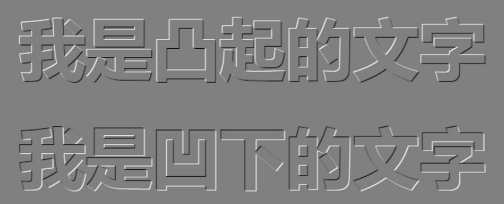
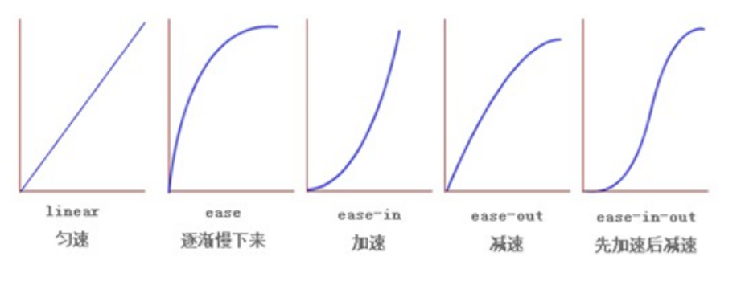
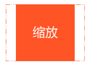
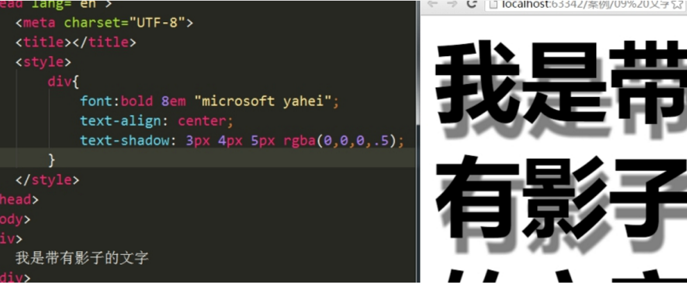

#### 表单域

标签：    <form action="url地址" method="提交方式" name="表单名称" >   双标签，里面会包含很多控件

action：在表单收集到信息后，需要将信息传输到服务器进行处理，action属性用于指定接收并处理表单数据的服务器程序URL地址。

method：设置表单信息的提交方式，其值为get或post

name：设置一个表单名称，用于区分一个页面多个表单


设置了表单域后，input控件的属性值type中的提交（submit）和重置（reset）便会生效，可以进行向服务器submit或者进行reset

#### CSS发展历程

从html被发明开始，样式就以各种形式存在，不同的浏览器结合它们各自的样式语言wei用户提供页面效果的控制。最初html只包含了很少的显示属性。

随着html的成长，为了满足页面设计中的需求，html增加了许多显示功能，但是随着功能的增加，html变得越来越乱，而且html页面也越来越臃肿，于是css便诞生了。

## CSS初识

CSSS(Cascading Style Sheets )美化样式

CSS通常称为CSS样式表或层叠样式表（级联样式表），主要用于设置html页面中的文本、图片的外形以及版面的布局等外观形式。

CSS以html为基础，提供了丰富的功能，如字体、颜色、背景的控制以及整体排版等，而且还可以针对不同的浏览器设置不同的样式。

#### 引入CSS样式表

内部样式表：写在head头部

行内样式表：写在html代码中

行内样式表：将所有样式写在一个或多个以CSS为扩展名的文件中，通过link标签将外部文件链接到html文件中

CSS格式（外部和内部）：

选择器{

属性：属性;

}

**标签选择器**

选择页面的标签

**类名选择器：**

在一个div里只能有一个class属性，如果需要多个类名可以  class=“类名 空格 类名”，即用空格把两个类名分开，如果多个类名里的属性里有冲突，受CSS样式书写的上下顺序有关，会用下面那个

**id选择器**

id的名称在一个页面是唯一的，一个id只能使用一次，和类选择器的最大不同在于使用次数

**通配符选择器**

通配符选择器用"*"号表示，能匹配页面上的所以元素。

##### 后代选择器

后代选择器又称为包含选择器，用来选择元素或者元素的后代，其写法就是把外层标签写在外面，内层标签写在后面，中间用空格间隔。当标签发生嵌套时，内层标签就是外层标签的后代，如：爷爷 后代 （所有的后代）{}

##### 子代选择器

与后代选择器的区别的多了一个大于号>，表示仅仅选择子代所选中的元素，其他后代不会被选中

##### 交集选择器

如css样式div.red{}中的选择器便是交集选择器，选中的元素既是div，class又叫red，中间是不用空格隔开的

##### 并集选择器

并集选择器用逗号“，”把所要选中的元素隔开，集体声明相同样式

#### 伪类选择器

伪类选择器用于向某些选择器增加特殊效果，比如给链接添加效果，比如可以选择第一个，第n个元素

类选择器以 . 开头，伪类选择器以 : 开头，比如：link{}

##### 链接伪类选择器

| :link    | 未访问的链接       |
| -------- | ------------------ |
| :visited | 已访问的链接       |
| :hover   | 鼠标移到链接上     |
| :active  | 鼠标按下链接的属性 |

四个伪类选择器不可以颠倒，

### CSS字体样式属性

**font-size**属性用于设置字体，该属性可以使用相对长度单位，也可以使用绝对长度单位，其中相对长度单位比较常用，推荐使用像素单位px，绝对长度单位使用较少：

| 相对长度单位 |              说明              |
| :----------: | :----------------------------: |
|      em      | 相对于当前对象内文本的字体尺寸 |
|      px      |          像素；最常用          |
| 绝对长度单位 |              说明              |
|      in      |              英寸              |
|      cm      |              厘米              |
|      mm      |              毫米              |
|      pt      |               点               |

**font-family**属性用于设置字体。网页常用的字体有宋体，微软雅黑，黑体等，例如：

div{font-family:"微软雅黑"；}

可以同时设置多个字体，中间用，号隔开，表示如果浏览器不支持第一种字体，则会尝试第二个，直到找到合适的字体

1、现有网页中普遍使用14px+

2、尽量使用偶数的数字字号，ie6等老浏览器支持奇数会有bug

3、各种字体之间必须用英文状态的逗号隔开

4、中文字体需要加英文状态下的引号，英文字体一般不需要加引号。当需要设置英文字体时，英文字体名必须位于中文字体之前

5、如果字体名中使用包含空格、#、$等符号，则该字体必须加英文状态下的单引号或双引号，例如                 font-family:"Times New Roman";

6、尽量使用默认字体，以保证任何用户的浏览器都能正确显示

**font-weight**用于设置字体的粗细,属性normal是正常字体，相当于number为400，声明此值将取消之前任何设置；bold为粗体，相当于number为700，也相当于b对象的作用

**font-style**用于设置字体风格，属性normal设置为正常字体，属性italic斜体，对于没有斜体变量的特殊字体，将应用oblique

#### 字体连写

选择器{font:font-style font-weight font-size/line-height font-family;}

字体连写是有顺序的,必须按照顺序写，用空格隔开，不需要的属性可以省略（默认），字号大小和字体是不可以省略的，必须保留，否则font属性不起作用

#### CSS外观属性

##### color:文本颜色   用于定义文本的颜色，有如下三种取值办法：

1、预定义颜色值，如red、blue、pink等等

2、十六制，如#000000、#FF6600等，实际工作中，十六进制是最常用的定义颜色方式。

3、RGB代码，如红色可以表示为rgb(255,0,0)或rgb(100%,0%,0%)，需要注意的是用RGB代码的百分比取色值，取值时即使为0也不可以省略%号，如0%


##### line-height行间距

用于设置行间距，字符间的垂直距离，即行高，属性值一般有三种：像素px、相对值em、和百分比%，实际工作中使用最多的是px，一般情况下，行距比字号大7.8像素就可以了

##### text-align对齐方式

用于设置文本内容的水平对齐方式，其属性值有：left左对齐，right右对齐，center居中对齐（用于div中是让盒子里面的内容居中对齐，并非盒子本身）

##### text-indent首行缩进

用于文本的首行缩进设置，属性值可以为不同的数值，em字符宽度的倍数、或相对于浏览器窗口的百分比%，允许使用负值，建议使用em作为单位，1em就是一个字的宽度，如果是汉字，1em就是一个汉字的宽度

##### text-decoration文本的装饰

通常用于链接修改装饰效果

| 值           | 描述                 |
| ------------ | -------------------- |
| none         | 默认，定义标准的文本 |
| underline    | 下划线               |
| line-through | 删除线               |
| overline     | 上划线               |

### 标签显示模式display

HTML标签通常分为块级标签和行内标签两种，它们也称为块级元素和行内元素

##### 块级元素（block-level）

常见的块级元素有：h1~h6、p、div、ul、ol、li等，其中div标签是最典型的块级元素

每个块级元素通常独自占据一整行或多行，可以对其设置宽度、高度、对齐等属性，常用语网页布局构建

块级元素的特点：

1、总是在新行开始

2、高度、行高、外边距和内边距都可以控制

3、宽度默认是容器的100%

4、可以容纳内联元素和其他块级元素

##### 行内元素（inline-level）

常见的行内元素有a、strong、b、em、i、del、s、ins、u、span、等，其中span是最典型的行内元素

行内元素（内联元素）不占有独立的区域，仅仅靠自身的字体大小和图像尺寸来支撑结构，一般不可以设置宽度、高度、对齐等属性，常用于控制页面文本的样式

行内元素的特点：

1、和相邻行内元素在一行上

2、高、宽无效，但水平方向的padding和margin可以设置，垂直方向无效

3、默认宽度就是他本身的宽度

4、行内元素之容纳文本或者其他行内元素。（a特殊）

##### 注意：

1、只有文字才能组成段落，因此p里面不能放块级元素，同理还有这些标签h1~h6，dt，他们都是文字类块级标签，里面不能放其他块级元素

2、链接里不能再放链接

3、a里面可以放块级元素

##### 行内块元素（inline-block）

在行内元素中有几个特殊的标签  --   img    、input、td，可以对他们设置宽度和对齐属性，有些资料可能会称他们为行内块元素

行内元素的特点：

1、和相邻行内元素（行内块）在一行上，但是之间会有间隙

2、默认宽度就是他本身内容的宽度

3、高度、宽度、内边距、外边距都可以控制

### 显示模式的转换

|         属性         |             描述             |
| :------------------: | :--------------------------: |
|    display:block     |    把行内元素变为块级元素    |
|    display:inline    |    把块级元素变为行内元素    |
| display:inline-black | 把行内元素转换为行内块级元素 |


#### 空格规范

1、选择器与{之间必须包含空格，实例：   .del {属性}

2、属性名与之后的:之间不允许有空格，:与属性之间	必须包含空格，例如：   font-size: 12px;

#### 选择器规范

1、当使用并级选择器包含多个selector时，每个选择器都要占一行用，隔开，例如：

.post,

.age,

.page {

​    line-height: 1.5;

}

2、选择器的嵌套层级应不大于3级，位置靠后的限定条件应尽可能准确

#### 属性规范

属性定义必须另起一行，属性定义后必须以分号结尾

### 行高的测量

基线与基线之间的距离称为行高

行高我们利用得最多的地方是：让一行文本在盒子模型中垂直居中

做法就是：文本的行高等于盒子的高度

如果行高小于盒子高度，文字会偏上

如果行高大于盒子高度，文字会偏上

一个完整的行高是由上距离，内容部分，下距离组成

### CSS三大特性

CSS层叠性，CSS继承性，CSS优先级

#### CSS层叠性

所谓的层叠性是指多种CSS样式的叠加

是浏览器处理冲突的一种能力，如果一种属性通过两个选择器设置到一个元素上，那么这个时候一个属性就会将另一个属性层叠掉。

比如给一个元素指定颜色为红色，接着又指定其为蓝色，此时出现了相同样式不同值的情况，这就是样式冲突，一般情况下，出现样式冲突，会按照CSS书写的顺序，以最后的样式为准。

1、样式冲突，遵循的原则是就近原则。那个样式离着结构近，就执行那个样式

2、样式不会冲突不会层叠

CSS样式最后的武林秘诀：长江后浪推前浪，前浪死在沙滩上

#### CSS继承性

所谓的继承性指的是书写CSS样式表时，子标签会继承父标签的某些样式，如文本颜色和字号，想要设置一下可以继承的属性，只需将它应用于父标签即可。

最简单的理解：子承父业

##### 注意：

恰当的利用继承可以简化代码，降低CSS样式表的复杂性，子元素可以继承父元素样式（text-，font-，line-这些元素开头都可以继承，以及color属性）

#### CSS优先级

定义CSS样式时，经常出现两个或更多规则应用于同一元素上，这就出现了优先级问题

在考虑权重时，初学者还需要注意一些特殊情况，具体如下：

继承样式的权重为0，既在嵌套结构中，不管父元素样式权重多大，被子元素继承时，他的权重都为0，也就是说子元素定义的样式会覆盖继承来的样式

行内样式优先。应用style属性的元素，其样式权重非常的高，可以理解为远大于100。他拥有比上面提高选择器都要大的优先级

权重相同时，CSS遵循就近原则，也就是说越靠近元素的样式具有最大的优先级

CSS定义了一个！important命令，该命令被赋予最大的优先级，也就是说无论权重如何或位置远近，!important都具有最大优先级

| 继承或*的贡献值          | 0，0，0，0 |
| ------------------------ | ---------- |
| 每个元素（标签）的贡献值 | 0，0，0，1 |
| 每个类，伪类贡献值       | 0，0，1，0 |
| 每个ID的贡献值           | 0，1，0，0 |
| 每个行内样式的贡献值     | 1，0，0，0 |
| 每个important的贡献值    | 无穷大     |

权重是可以叠加的：

div ul li -----> 0,0,0,3

.nav ul li ---->0,0,1,2

a:hover  ---->0,0,1,1

.nav a    ---->0,0,1,1

#nav p   ---->0,1,0,1

##### 注意：

数位之间是没有进制的，比如说：0，0，0，5+0，0，0，5=0，0，0，10，而不是0，0，1，0，所以不会存在10个div就可以赶上一个类选择器的情况

继承的权重是0

### 背景background

|         属性          |               描述               | 属性值                                                       |
| :-------------------: | :------------------------------: | :----------------------------------------------------------- |
|   background-color    |             背景颜色             | 属性值为颜色                                                 |
|   background-image    |             背景图片             | url(.../.../01.jpg)                                          |
|   background-repeat   |          背景图如何铺排          | repeat:背景图在横向或纵相平铺<br/>no-repeat：背景图不平铺<br/>repeat-x：背景图在横向上平铺<br/>repeat-y：背景图在纵向平铺 |
|  background-position  |         设置背景图的位置         | x y；<br/>x为x轴，y为y轴<br/>可以跟方位名词，他们之间可以没有上下顺序<br/>如果只写一个值，另一个值为居中<br/>后面也可以跟值（例如PX） |
| background-attachment | 设置背景图像随内容滚动还是固定的 | scroll：随对象内容滚动（默认）<br/>fixed：固定的             |

#### 背景简写

背景简写书写顺序官方没有强制标准的。为了可读性，建议如下方式：

background：背景颜色 背景图片地址 背景平铺 背景滚动 背景位置

background：transparent url(image.jpg) repeat scroll center top；

#### 背景透明(CSS3)

background：rgba（0，0，0，.3）  r指的是red，g指的是green，b指的是blue，a指的是alpha透明度

## 盒子模型

### 盒子边框（border）

属性：border-width||border-style||border-color

分别指：边框的粗细||边框的样式||边框的样式

| 属性   | 描述                                                         |
| ------ | ------------------------------------------------------------ |
| none   | 无边框。与任何指定的border-width无关                         |
| hidden | 隐藏边框，IE不支持                                           |
| dotted | 在MAC平台上IE4+与Windows和UNIX平台上IE5.5+为点线。否则为实线 |
| dashed | 在MAC平台上IE4+与Windows和UNIX平台上IE5.5+为点线。否则为实线 |
| solid  | 实线边框                                                     |
| double | 双线边框                                                     |
| groove | 根据background-color值画3D凹槽                               |
| ridge  | 根据background-color值画菱形边框                             |
| inset  | 根据background-color值画3D凹边                               |
| outset | 根据background-color值画3D凸边                               |

#### 边框连写

边框连写是没有顺序要求的，一般我们都写为：

border：1px solid red；

盒子边框四边分开写：

border-方位：1px solid red；

##### 合并相邻边框（border	-collapse:collapse）：把表格相邻的边框合并，让表格边框更细一点

### 内边距（padding）

padding-方向：属性；表示设置边框与内容之间的距离

##### 注意：后面几个数值表示的意思不一样的

| 值得个数             | 描述                                                |
| -------------------- | --------------------------------------------------- |
| 1个值为1px           | 表示上下左右内边距都为1px                           |
| 2个值为1px 2px       | 表示上下内边距为1px，左右内边距为2px                |
| 3个值1px 2px 3px     | 表示上内边距为1px，左右内边距为2px，下内边距为3px   |
| 4个值1px 2px 3px 4px | 表示上右下左内边距分别 为上1px，右2px，下3px，左4px |

##### padding会撑开带有width和height的盒子，如果出现这样的情况，可以修改width和height进行解决

#### 外边距实现盒子居中

必要的两个条件：

1、必须是块级元素

2、盒子必须指定宽度（width）

以下代码都可以实现盒子居中，代码不一样，但是功能基本一样的

| 代码                                         | 描述                                       |
| -------------------------------------------- | ------------------------------------------ |
| margin:0 auto；                              | 设置上下外边距为0，左右外边距充满          |
| margin-left：auto；<br/>margin-right：auto； | 分别设置左右外边距充满                     |
| margin：auto；                               | 设置的所有方向充满，但是上下设置的auto无效 |

让一个盒子水平居中，保证左右auto就可以了，加了浮动和定位的盒子，auto就会失效

#### 清除元素的默认内外边距

为了方便控制网页中的元素，制作网页时，可使用如下代码清除元素默认的内外边距：

*{

​    padding:0;

​    margin:0;

}

##### 注意：行内元素是有左右外边距的，没有上下外边距的。内边距，在ie6等低版本刘拉起也会有问题。

我们尽量不要给行内元素指定上下的内外边距就好

### 外边距合并

-使用margin定义元素的垂直边距时，可能会出现外边距的合并

#### 相邻元素垂直外边距的合并

当上下相邻的两个块元素相遇时，如果上面的元素有margin-bottom，下面的元素有margin-top，那么他们之间的垂直间距不是margin-bottom跟margin-top之和，而是两者之中的最大者，这种现象被称为相邻块级元素垂直距离的合并（也称为外边距塌陷）。

解决方案：避免就好

#### 嵌套块级元素垂直外边距的合并

对于两个嵌套关系的块级元素，如果父元素没有padding-top或边框，则父元素的margin-top会与子元素的margin-top发生合并，合并后的margin-top为两者中的较大者，即使父元素的margin-top为0，也会发生合并。

解决方案：

1、可以为父元素定义一个1px的border-top或padding-top

2、可以为父元素添加overflow：hidden

待续。。

### content宽度和高度

使用宽度属性width和高度属性height可以对盒子大小进行控制

width和height的属性值可以为不同的单位数值或者相对于父元素的百分比%，实际工作中像素最常用

大多数浏览器，如Firefox、ie6及以上版本都采用了w3c规范，符合css规范的盒子模型的总宽度和总高度的计算原则是：

外盒尺寸计算（元素控件尺寸）

Element	空间高度=content height+padding-top+padding-bottom+border+margin-top+margin-bottom

Element 空间宽度=content width+padding-left+padding-right+border+margin-width+margin-right

内盒尺寸计算（元素实际大小）

Element	内容高度=content height+padding-top+padding-bottom+border+margin-top+margin-bottom

Element 内容宽度=content width+padding-left+padding-right+border

相对：控件尺寸比实际大小少了外边距

##### 注意：

1、宽度属性width和高度属性height仅适用于块级元素，对行内元素无效（img标签，input标签除外）

2、计算盒子模型的总高度时，还要考虑上下两个盒子的垂直外边距合并的情况

3、如果一个盒子没有指定宽度，则会和父元素一样宽，占满父元素的宽度，则padding不会撑开盒子（因为子元素没有给定width，用的是默认的宽度）

#### 盒子模型的稳定性

稳定性排列：

width>padding>margin

原因：

1、margin会有外边距的合并，还要ie6下面的margin加倍的bug，所以排最后

2.padding会影响盒子大小，需要进行加减计算，其次使用

3、width没有问题，我们经常使用宽度剩余法和高度剩余法来做

#### 圆角边框（CSS3）

语法格式：border-radius： 50%；让一个正方形变成圆圈，50%指的是矩形边长的50%

另一种语法：border-radius：1px 1px 1px 1px;   分别是左上右上右下左下，跟padding的计算方式一样

IE8及以下浏览器不适用此功能

#### 盒子阴影（CSS3）

语法格式：box-shadow：水平阴影，垂直阴影，模糊距离，阴影尺寸，阴影颜色，内/外阴影；

|    值    |              描述              |
| :------: | :----------------------------: |
| h-shadow | 必需。水平阴影的位置。允许负值 |
| v-shadow | 必需。垂直阴影的位置。允许负值 |
|   blur   |         可选。模糊距离         |
|  spread  |         可选。阴影尺寸         |
|  color   |       可选。阴影的颜色。       |
|  inset   |  可选。将外部阴影改为内部阴影  |

1、前两个是必需写的，其他可选

### 浮动（float）

#### 普通流（normal flow）

这个单词很多人翻译为文档流，字面翻译普通流或者文档流都可以

CSS定位的方式有三种：普通流、浮动、定位

为什么用浮动？

浮动可以让多个div在一行内显示

什么是浮动？

元素的浮动是指设置了浮动的属性的元素会脱离标准标准流的控制，移动到其父元素指定位置的过程

在CSS中，通过float属性来定义浮动，其基本语法格式如下：

选择器 {float: 属性值;}

| 属性值 | 描述               |
| ------ | ------------------ |
| left   | 元素向左浮动       |
| right  | 元素向右浮动       |
| none   | 元素不浮动（默认） |

##### 浮动的特性

1、浮动只有向左向右对齐

2、浮动脱离标准流，不占位置，会下面的影响标准流

3、一个父盒子中的一个盒子浮动，按道理其他兄弟盒子也要浮动才能在一行显示

4、如果已经给行内元素指定了浮动，此时不需要再转换，该元素就会有宽高

##### 浮动的隐藏方式：浮动可以让元素具有行内块级元素的特性

## 版心和布局流程

“版心”（可视区）是指网页主体中内容所在的区域，一般在浏览器窗口水平居中，常见的宽度有960px,980px,1000px,1200px等

#### 布局流程

为了提高网页制作的效率，布局时通常需要遵循一定的布局流程，具体如下：

1、确认页面的版心（可视区）。

2、分析网页中的行模块，以及每个行模块的列模块。

3、制作HTML结构

4、CSS初始化，然后开始运用盒子原理，通过div+css控制网页的各个模块

### 使用after伪元素清除浮动

##### :after方式为空元素的升级版，好处就是不用再加标签了

使用方法：

.clearfix:after{content: ""; display: block; height: 0; clear:both; visibility: hidden;}

.clearfix {*zoom: 1;}  ie6、7专有

### 使用before和after双伪元素清除浮动

使用方法：

.clearfix:before,.clearfix:after {content: ""; display: table;}

.clearfix:after { clear: both;}

.clearfix {*zoom: 1;}

#### 清除浮动的本质

清除浮动主要为了解决父级元素因为子级元素浮动引起内部高度为0的问题

## 定位（position）

#### 元素的定位属性

元素的定位属性主要包括定位模式和边偏移两部分。


##### 1、边偏移

| 边偏移属性 | 描述                                           |
| ---------- | ---------------------------------------------- |
| top        | 顶端偏移量，定义元素相对于其父元素上边线的距离 |
| bottom     | 底部偏移量，定义元素相对于其父元素下边线的距离 |
| left       | 左侧偏移量，定义元素相对于其父元素左边线的距离 |
| right      | 右侧偏移量，定义元素相对于其父元素右边线的距离 |

##### 2、定位模式（定位的分类）

在css中position属性应用于定义元素的定位模式，其基本语法如下：

选择器{position: 属性值；}

position属性的changyongzchangyong常用值

| 值       | 描述                                           |
| -------- | ---------------------------------------------- |
| static   | 静态定位（默认方式）                           |
| relative | 相对定位，相对原文档流的位置进行定位           |
| absolute | 绝对定位，相对于上一个已经定位的父元素进行定位 |
| fixed    | 固定定位，相对于浏览器窗口进行定位             |

### 静态定位（static）

静态定位是所有元素的默认定位方式，当position取值为static时，可以将元素定位于静态位置，所谓的静态位置就是各个元素在HTML文档流中默认的位置

ps：所谓的静态定位，就是html的默认定位方式，标准流的特性

静态定位唯一的用途：取消定位。

### 相对定位(relative)

1、相对定位最重要的一点是，它可以通过边偏移移动位置，但是原来所占有的位置，继续占有

2、其次，每次移动的位置，是以自己的左上角为基点移动（相对自己的位置进行移动）

就是说，相对定位的盒子仍在标准流中，它后面的盒子仍以标准流方式对待他。（相对定位不脱标）

如果说浮动的主要目的是让多个块级元素一行显示，那么定位的主要价值就是移动位置，让盒子到我们想要的位置上去

### 绝对定位（absolute）

1、绝对定位不占位置

2、没有祖先元素的时候，以浏览器的当前屏幕为基准对齐

3、祖先元素没有定位的时候，以浏览器的当前屏幕为对齐基准

4、祖先元素有定位（绝对、相对或固定定位）的时候，会根据已经定位的最近的祖先元素进行定位

#### 子绝父相

这句话的意思是说，子元素用绝对定位，父元素用相对定位

#### 绝对定位的盒子水平/垂直居中对齐	

普通的盒子左右margin改为auto即可，但是对于absolute就无效了，定位的盒子也可以垂直居中，有一个算法：

首先left50%，让盒子位于父盒子左边一半之外，然后设置自己的外边距margin-left，指为自身宽度的一半（往回走），上下也是一样的

#### 固定定位（fixed）

固定定位是绝对定位的一种特殊形式，他只会在浏览器固定的位置呈现

#### 定位模式转换

跟浮动一样，当元素加了绝对定位和固定定位后，元素模式也会发生变化，都转换为行内块级元素

行内块级元素的宽度和高度跟内容有关

#### 叠放次序z-index

在css中，要想调整重叠定位元素的堆叠顺序，可以对定位元素应用z-index层叠等级属性，取值可以为正整数，负整数和0.比如  z-index：2；

##### 注意：

1、z-index的默认值为0，取值越大，定位元素在层叠元素中越居上

2、取值相等，则根据书写顺序，后来者居上

3、只有相对定位，绝对定位，固定定位有此属性，其余标准流，浮动，静态定位都无此属性，也不可指定此属性

#### 四种定位总结

| 定位模式         | 是否脱标占有位置   | 是否可以使用边偏移 | 移动位置基准                     |
| ---------------- | ------------------ | ------------------ | -------------------------------- |
| 静态static       | 不脱标，占有位置   | 不可以             | 正常模式                         |
| 相对定位relative | 不脱标，占有位置   | 可以               | 相对自身位置移动（自恋型）       |
| 绝对定位absolute | 完全脱标，不占位置 | 可以               | 相当于定位父级移动位置（拼爹型） |
| 固定定位fixed    | 完全脱标，不占位置 | 可以               | 相对于浏览器移动位置（认死理型） |

### CSS高级技巧

#### 元素的显示与隐藏

在css中，有三个显示与隐藏的单词比较常见，要区分开，分别是display、visibility和overflow

他们的作用是让元素在页面中隐藏起来，不是删除掉

#### display显示

display设置或检索对象是否及如何显示

display：none 隐藏对象，与他相反的是display：block 除了转换为块级元素之外，同时还要显示元素的意思

##### 特点：隐藏之后不再保留位置

#### visibility可见性

与display相比，最大的区别就是隐藏后保留位置

visible:对象可视

hidden：隐藏

#### overflow溢出

| 值      | 描述                                                         |
| ------- | ------------------------------------------------------------ |
| visible | 默认的                                                       |
| auto    | 此为body对象和textarea的默认值。在需要时剪切内容并增加滚动条 |
| hidden  | 不显示超出对象尺寸的内容                                     |
| scroll  | 总是显示滚动条                                               |

## 用户界面设置

### 鼠标样式

语法： 选择器 {cursor:值；}

| default | 默认样式    |
| ------- | ----------- |
| pointer | 小手        |
| move    | 十字架/移动 |
| text    | 文本        |
| 待续    | 待续        |

### 轮廓outline

是绘制元素周围的一条线，位于边框边缘的外围，可起到突出元素的作用

outline：outline-color||outline-style||outline-width

一般都不需要其设置的，一般都会直接去掉

outline：0 ；或者outline：none；

#### 防止拖拽文本域

语法：resize：none

设置了之后，文本域右下角将不可拖拽

#### vertical-align 垂直对齐

vertical-align不影响块级元素中的内容对齐，它只针对于行内元素或者行内块元素，特别是行内块元素，通常用来控制图片/表单与文字的对齐

| vertical-align：baseline | 基线对齐（默认图片是和文字基线对齐的） |
| ------------------------ | -------------------------------------- |
| vertical-align：middle   | 居中对齐                               |
| vertical-align：top      | 顶部对齐                               |

此属性用来控制图片、表单和文字的对齐方式

#### 解决图片底部有3px空白的方法

1、vertical-align:top；  让图片顶部对齐，使得底部没有空白

2、display：block；  改为块级元素，独自占一行

#### 溢出文字的隐藏

#####  white-space

white-space设置或检索对象内文本显示方式，通常我们使用于强制一行内容

normal：默认处理方式（自动换行）

nowrap：强制一行显示，直到文本结束或遭遇br标签才换行

### text-overflow文字溢出

text-overflow:clip||ellipsis

设置检索是否使用一个省略标记（....）标示对象内文本的溢出

clip：不使用省略号，而是简单的裁剪

ellipsis：对文本溢出的内容使用省略号标记

## CSS精灵技术（sprite）小妖精  雪碧

精灵技术是为了减少向服务器请求的次数，增加打开网页的速度

#### 精灵技术的本质

css精灵是一种处理网页背景图像的方式，它将一个网页涉及到的所有零星背景图像都集中到一张大图去，然后将大图应用于网页，这样，当用户访问网页时，只需要发送一次请求，网页的背景图像即可全部展示出来。通常情况下，这样的图像称为精灵图（背景图）

#### 精灵技术的原理

把一张精灵图插入所需要用的位置作为背景图，然后使用背景图定位到所需要用该图像的位置

##### 缺点：改起来比较麻烦

### 滑动门

结构由a包span，左边取背景图的左侧对齐，span背景图右侧对齐，然后各取内边距实现文字居中，左右留着门把子。

### 字体图标

图片是有很多优点，但是缺点很明显，比如图片不但增加了总文件的大小，还增加了额外的“HTTP请求”，这都会降低网页的性能，更重要的是图片不能做很好的缩放，因为图片放大缩小会失真，此时，字体图标的作用就来了（iconfont）

#### 字体图标的优点

1、可以做出和图片一样可以做的事情，改变透明度，旋转度等等

2、本质是字体，可以随意改变颜色，产生阴影，透明效果等等

3、体积小，携带的信息并没有缩减

4、几乎支持所有浏览器

5、移动设备必备良药

#### 字体图标使用流程

##### 下载：

德国网站： http://icomoon.io

阿里字体：http://www.iconfont.cn/

##### 引入：

首先把下载得到fonts的四个文件连同文件夹放好

##### 声明：其次在css里声明：

@font-face {
  font-family: 'icomoon';
  src:  url('fonts/icomoon.eot?7kkyc2');
  src:  url('fonts/icomoon.eot?7kkyc2#iefix') format('embedded-opentype'),
​    url('fonts/icomoon.ttf?7kkyc2') format('truetype'),
​    url('fonts/icomoon.woff?7kkyc2') format('woff'),
​    url('fonts/icomoon.svg?7kkyc2#icomoon') format('svg');
  font-weight: normal;
  font-style: normal;
}

再次给盒子声明字体：

span {
​		font-family: "icomoon";
​	}

就可以使用啦！

### 设计图标字体

用ai软件设计好，保存为svg格式

上传我们的字体包到网页上

#### ico图标

在网址后面加上favicon.ico即可找到

代码link rel="shortcut icon" href="ico图标地址" type="image/x-icon"/

##### 注意：

1、它不是iconfont字体

2、位置是放在head标签中间

3、后面的 type="image/x-icon"属性可以省略

4、为了兼容性，请将favicon.ico这个图标放在根目录下

## 站内seo的标签

### title

titletitle具有不可替代性，是我们内页第一个重要的标签，是搜索引擎了解网页的入口

| 标题的长度 | Google(70KB),35个中文<br/>百度(56KB)，28个中文 |
| ---------- | ---------------------------------------------- |
| 关键字分布 | 最先出现的词语权重越高                         |
| 关键子词频 | 主关键词出现三次<br/>辅关键词出现一次          |

##### 建议：首页标题：网站名（产品名）-网站的介绍

参考：京东、小米

### description网站说明

注意点：

1、描述中出现关键词，与正文内容相关，这部分是给人看的，所以要写详细，让人感兴趣

2、同样遵循简短原则，字符数含空格在内不要超过120个汉字

3、补充在title和keywords中未能充分表述说明

4、用英文逗号 关键词1,关键词2

参考小米

### keywords关键词

kerwords是搜索引擎的关注点之一，应该限制在6-8个词左右

## CSS W3C 统一验证工具

CssStats是一个在线的css代码分析工具

网址是：http://www.cssstats.com/

如果你想要更全面的，这个神奇，你值得拥有：

W3C 统一验证工具：    http://validator.w3.org/unicorn/  ☆☆☆☆☆

因为它可以检测本地文件哦！！

## HTML5新标签与特性


## 文档类型设定

- document
  - HTML:        sublime 输入  html:4s
  - XHTML:      sublime 输入  html:xt
  - HTML5        sublime 输入  html:5       <!DOCTYPE html>

## 字符设定

- <meta http-equiv="charset" content="utf-8">：HTML与XHTML中建议这样去写
- <meta charset="utf-8">：HTML5的标签中建议这样去写

## 常用新标签

 w3c  手册中文官网     :   http://w3school.com.cn/

- header：定义文档的页眉 头部

- nav：定义导航链接的部分

- footer：定义文档或节的页脚 底部

- article：定义文章。

- section：定义文档中的节（section、区段）

- aside：定义其所处内容之外的内容 侧边

  ```html
  <header> 语义 :定义页面的头部  页眉</header>
  <nav>  语义 :定义导航栏 </nav> 
  <footer> 语义: 定义 页面底部 页脚</footer>
  <article> 语义:  定义文章</article>
  <section> 语义： 定义区域</section>
  <aside> 语义： 定义其所处内容之外的内容 侧边</aside>
  ```

  - datalist   标签定义选项列表。请与 input 元素配合使用该元素

    ```html
    <input type="text" value="输入明星" list="star"/> <!--  input里面用 list -->
    <datalist id="star">   <!-- datalist 里面用 id  来实现和 input 链接 -->  
        		<option>刘德华</option>
        		<option>刘若英</option>
        		<option>刘晓庆</option>
        		<option>郭富城</option>
        		<option>张学友</option>
        		<option>郭郭</option>
    </datalist>
    ```

  - fieldset 元素可将表单内的相关元素分组，打包      legend 搭配使用

    ```HTML
    <fieldset>
        		<legend>用户登录</legend>  标题
        		用户名: <input type="text"><br /><br />
        		密　码: <input type="password">
    </fieldset>
    ```


  ## 新增的input type属性值：

  | **类型******     | **使用示例******        | **含义******         |
  | ---------------- | ----------------------- | -------------------- |
  | **email******    | <input type="email">    | 输入邮箱格式         |
  | **tel******      | <input type="tel">      | 输入手机号码格式     |
  | **url******      | <input type="url">      | 输入url格式          |
  | **number******   | <input type="number">   | 输入数字格式         |
  | **search******   | <input type="search">   | 搜索框（体现语义化） |
  | **range******    | <input type="range">    | 自由拖动滑块         |
  | **time******     | <input type="time">     | 小时分钟             |
  | **date******     | <input type="date">     | 年月日               |
  | **datetime****** | <input type="datetime"> | 时间                 |
  | **month******    | <input type="month">    | 月年                 |
  | **week******     | <input type="week">     | 星期 年              |

  ##  

  ## 常用新属性

  | **属性******         | **用法******                                   | **含义******                                                 |
  | -------------------- | ---------------------------------------------- | ------------------------------------------------------------ |
  | **placeholder******  | <input type="text" placeholder="请输入用户名"> | 占位符  当用户输入的时候 里面的文字消失  删除所有文字，自动返回 |
  | **autofocus******    | <input type="text" autofocus>                  | 规定当页面加载时 input 元素应该自动获得焦点                  |
  | **multiple******     | <input type="file" multiple>                   | 多文件上传                                                   |
  | **autocomplete****** | <input type="text" autocomplete="off">         | 规定表单是否应该启用自动完成功能  有2个值，一个是on 一个是off      on 代表记录已经输入的值  1.autocomplete 首先需要提交按钮 <br/>2.这个表单您必须给他名字 |
  | **required******     | <input type="text" required>                   | 必填项  内容不能为空                                         |
  | **accesskey******    | <input type="text" accesskey="s">              | 规定激活（使元素获得焦点）元素的快捷键   采用 alt + s的形式  |


  ## 综合案例

  ```html
  <form action="">
    <fieldset>
      <legend>学生档案</legend>
      <label for="userName">姓名:</label>
      <input type="text" name="userName" id="userName" placeholder="请输入用户名"> <br>
      <label for="userPhone">手机号码:</label>
      <input type="tel" name="userPhone" id="userPhone" pattern="^1\d{10}$"><br>
      <label for="email">邮箱地址:</label>
      <input type="email" required name="email" id="email"><br>
      <label for="collage">所属学院:</label>
      <input type="text" name="collage" id="collage" list="cList" placeholder="请选择"><br>
      <datalist id="cList">
        <option value="前端与移动开发学院"></option>
        <option value="java学院"></option>
        <option value="c++学院"></option>
      </datalist><br>
      <label for="score">入学成绩:</label>
      <input type="number" max="100" min="0" value="0" id="score"><br>
     <form action="">
      <fieldset>
      	<legend>学生档案思密达</legend>
      	<label>姓名: <input type="text" placeholder="请输入学生名字"/></label> <br /><br />
      	<label>手机号: <input type="tel" /></label> <br /><br />
      	<label>邮箱: <input type="email" /></label> <br /><br />
      	<label>所属学院:  <input type="text" placeholder="请选择学院" list="xueyuan"/>
      	<datalist id="xueyuan">
      		<option>java学院</option>
      		<option>前端学院</option>
      		<option>php学院</option>
      		<option>设计学院</option>
      	</datalist>
  
      	<br /><br />
  
      	<label>出生日期:   <input type="date" /></label> <br /><br />
      	<label>成绩:  <input type="number" /></label> <br /><br />
      	<label>毕业时间:  <input type="date" /></label> <br /><br />
      	<input type="submit" />  <input type="reset" />
      </fieldset>
      </form>
      <label for="inTime">入学日期:</label>
      <input type="date" id="inTime" name="inTime"><br>
      <label for="leaveTime">毕业日期:</label>
      <input type="date" id="leaveTime" name="leaveTime"><br>
      <input type="submit">
    </fieldset>
  </form>
  ```


  ## 多媒体标签

  - embed：标签定义嵌入的内容
  - audio：播放音频
  - video：播放视频

  ### 多媒体 embed（会使用）

  embed可以用来插入各种多媒体，格式可以是 Midi、Wav、AIFF、AU、MP3等等。url为音频或视频文件及其路径，可以是相对路径或绝对路径。

  因为兼容性问题，我们这里只讲解 插入网络视频， 后面H5会讲解 audio 和video 视频多媒体。 

  ```html
  <embed src="http://player.youku.com/player.php/sid/XMTI4MzM2MDIwOA==/v.swf" allowFullScreen="true" quality="high" width="480" height="400" align="middle" allowScriptAccess="always" type="application/x-shockwave-flash"></embed>
  ```


   

   优酷，土豆，爱奇艺，腾讯、乐视等等

  1. 先上传   
  2. 在分享

  ### 多媒体 audio

  HTML5通过<audio>标签来解决音频播放的问题。

  使用相当简单，如下图所示

   

  并且可以通过附加属性可以更友好控制音频的播放，如：

  autoplay 自动播放

  controls 是否显不默认播放控件

  loop 循环播放    如果这个属性不写 默认播放一次        loop  或者  loop = “loop”    表示无限循环

  由于版权等原因，不同的浏览器可支持播放的格式是不一样的，如下图供参考

   

  多浏览器支持的方案，如下图

  <source> 标签允许您规定可替换的视频/音频文件供浏览器根据它对媒体类型或者编解码器的支持进行选择

   


  ### 多媒体 video

  HTML5通过<audio>标签来解决音频播放的问题。

  同音频播放一样，<video>使用也相当简单，如下图

   

  同样，通过附加属性可以更友好的控制视频的播放

  autoplay 自动播放

  controls 是否显示默认播放控件

  loop 循环播放

  width 设置播放窗口宽度

  height 设置播放窗口的高度

  由于版权等原因，不同的浏览器可支持播放的格式是不一样的，如下图供参考

   

  **多浏览器支持的方案，如下图******

  

  # 


# CSS3 新增选择器

### 结构(位置)伪类选择器（CSS3)

- :first-child :选取属于其父元素的首个子元素的指定选择器
- :last-child :选取属于其父元素的最后一个子元素的指定选择器
- :nth-child(n) ： 匹配属于其父元素的第 N 个子元素，不论元素的类型
- :nth-last-child(n) ：选择器匹配属于其元素的第 N 个子元素的每个元素，不论元素的类型，从最后一个子元素开始计数。
  n 可以是数字、关键词或公式
- 

```css
li:first-child { /*  选择第一个孩子 */
        		color: pink; 
        	}
li:last-child {   /* 最后一个孩子 */
        		color: purple;
        	}
li:nth-child(4) {   /* 选择第4个孩子  n  代表 第几个的意思 */ 
				color: skyblue;
        	}
```


### 目标伪类选择器(CSS3)

 :target目标伪类选择器 :选择器可用于选取当前活动的目标元素

```css
:target {
		color: red;
		font-size: 30px;
}
```

## 属性选择器

选取标签带有某些特殊属性的选择器 我们成为属性选择器

```css
/* 获取到 拥有 该属性的元素 */
div[class^=font] { /*  class^=font 表示 font 开始位置就行了 */
			color: pink;
		}
div[class$=footer] { /*  class$=footer 表示 footer 结束位置就行了 */
			color: skyblue;
		}
div[class*=tao] { /* class*=tao  *=  表示tao 在任意位置都可以 */
			color: green;
		}
```

```html
<div class="font12">属性选择器</div>
    <div class="font12">属性选择器</div>
    <div class="font24">属性选择器</div>
    <div class="font24">属性选择器</div>
    <div class="font24">属性选择器</div>
    <div class="24font">属性选择器123</div>
    <div class="sub-footer">属性选择器footer</div>
    <div class="jd-footer">属性选择器footer</div>
    <div class="news-tao-nav">属性选择器</div>
    <div class="news-tao-header">属性选择器</div>
    <div class="tao-header">属性选择器</div>
```

## 伪元素选择器（CSS3)

1. E::first-letter文本的第一个单词或字（如中文、日文、韩文等）
2. E::first-line 文本第一行；
3. E::selection 可改变选中文本的样式；

```css
p::first-letter {
  font-size: 20px;
  color: hotpink;
}

/* 首行特殊样式 */
p::first-line {
  color: skyblue;
}

p::selection {
  /* font-size: 50px; */
  color: orange;
}
```


4、E::before和E::after

在E元素内部的开始位置和结束位创建一个元素，该元素为行内元素，且必须要结合content属性使用。

```css
div::befor {
  content:"开始";
}
div::after {
  content:"结束";
}
```


E:after、E:before 在旧版本里是伪元素，CSS3的规范里“:”用来表示伪类，“::”用来表示伪元素，但是在高版本浏览器下E:after、E:before会被自动识别为E::after、E::before，这样做的目的是用来做兼容处理。

":" 与 "::" 区别在于区分伪类和伪元素

之所以被称为伪元素，是因为他们不是真正的页面元素，html没有对应的元素，但是其所有用法和表现行为与真正的页面元素一样，可以对其使用诸如页面元素一样的css样式，表面上看上去貌似是页面的某些元素来展现，实际上是css样式展现的行为，因此被称为伪元素。是伪元素在html代码机构中的展现，可以看出无法伪元素的结构无法审查


**注意**

伪元素:before和:after添加的内容默认是inline元素**；这个两个伪元素的`content`属性，表示伪元素的内容,设置:before和:after时必须设置其`content`属性，否则伪元素就不起作用。


## 背景缩放(CSS3)

通过background-size设置背景图片的尺寸，就像我们设置img的尺寸一样，在移动Web开发中做屏幕适配应用非常广泛。

其参数设置如下：

a) 可以设置长度单位(px)或百分比（设置百分比时，参照盒子的宽高）

b) 设置为cover时，会自动调整缩放比例，保证图片始终填充满背景区域，如有溢出部分则会被隐藏。我们平时用的cover 最多

c) 设置为contain会自动调整缩放比例，保证图片始终完整显示在背景区域。

```css
background-image: url('images/gyt.jpg');
			background-size: 300px 100px;
			/* background-size: contain; */
			/* background-size: cover; */
```

## 多背景(CSS3)

以逗号分隔可以设置多背景，可用于自适应布局  做法就是 用逗号隔开就好了。

- 一个元素可以设置多重背景图像。 
- 每组属性间使用逗号分隔。 
- 如果设置的多重背景图之间存在着交集（即存在着重叠关系），前面的背景图会覆盖在后面的背景图之上。
- 为了避免背景色将图像盖住，背景色通常都定义在最后一组上，

```css
background:url(test1.jpg) no-repeat scroll 10px 20px/50px 60px  ,
	   url(test1.jpg) no-repeat scroll 10px 20px/70px 90px ,
	   url(test1.jpg) no-repeat scroll 10px 20px/110px 130px c #aaa;
```

- 

## 凹凸文字

```css
<head>
        <meta charset="utf-8">
        <style>
        body {
        	background-color: #ccc;
        }
		div {
			color: #ccc;
			font: 700 80px "微软雅黑";
		}
		div:first-child {
			/* text-shadow: 水平位置  垂直位置  模糊距离 阴影颜色; */
			text-shadow: 1px 1px 1px #000, -1px -1px 1px #fff;
		}
		div:last-child {
			/* text-shadow: 水平位置  垂直位置  模糊距离 阴影颜色; */
			text-shadow: -1px -1px 1px #000, 1px 1px 1px #fff;
		}

        </style>
    </head>
    <body>
    <div>我是凸起的文字</div>
    <div>我是凹下的文字</div>
    </body>
```




## CSS3盒模型

CSS3中可以通过box-sizing 来指定盒模型，即可指定为content-box、border-box，这样我们计算盒子大小的方式就发生了改变。

可以分成两种情况：

1、box-sizing: content-box  盒子大小为 width + padding + border   content-box:此值为其默认值，其让元素维持W3C的标准Box Mode

2、box-sizing: border-box  盒子大小为 width    就是说  padding 和 border 是包含到width里面的

注：上面的标注的width指的是CSS属性里设置的width: length，content的值是会自动调整的。

```css
div:first-child {
			width: 200px;
			height: 200px;
			background-color: pink; 
			box-sizing: content-box;  /*  就是以前的标准盒模型  w3c */
			padding: 10px;
			border: 15px solid red;
			/* 盒子大小为 width + padding + border   content-box:此值为其默认值，其让元素维持W3C的标准Box Mode */
		}
		div:last-child {
			width: 200px;
			height: 200px;
			background-color: purple;
			padding: 10px;
			box-sizing: border-box;   /* padding border  不撑开盒子 */
			border: 15px solid red;
			/* margin: 10px; */
			/* 盒子大小为 width    就是说  padding 和 border 是包含到width里面的 */
}
```

##学成在线综合案例 

## 过渡(CSS3)

过渡（transition)是CSS3中具有颠覆性的特征之一，我们可以在不使用 Flash 动画或 JavaScript 的情况下，当元素从一种样式变换为另一种样式时为元素添加效果。

帧动画：通过一帧一帧的画面按照固定顺序和速度播放。如电影胶片


在CSS3里使用transition可以实现补间动画（过渡效果），并且当前元素只要有“属性”发生变化时即存在两种状态(我们用A和B代指），就可以实现平滑的过渡，为了方便演示采用hover切换两种状态，但是并不仅仅局限于hover状态来实现过渡。

语法格式:

~~~
transition: 要过渡的属性  花费时间  运动曲线  何时开始;
如果有多组属性变化，还是用逗号隔开。
~~~

| 属性                       | 描述                                         | CSS  |
| -------------------------- | -------------------------------------------- | ---- |
| transition                 | 简写属性，用于在一个属性中设置四个过渡属性。 | 3    |
| transition-property        | 规定应用过渡的 CSS 属性的名称。              | 3    |
| transition-duration        | 定义过渡效果花费的时间。默认是 0。           | 3    |
| transition-timing-function | 规定过渡效果的时间曲线。默认是 "ease"。      | 3    |
| transition-delay           | 规定过渡效果何时开始。默认是 0。             | 3    |

如果想要所有的属性都变化过渡， 写一个all 就可以

transition-duration  花费时间  单位是  秒     s    比如 0.5s    这个s单位必须写      ms 毫秒

运动曲线   默认是 ease

 何时开始  默认是 0s  立马开始

运动曲线示意图：



~~~css
div {
			width: 200px;
			height: 100px;
			background-color: pink;
			/* transition: 要过渡的属性  花费时间  运动曲线  何时开始; */
			transition: width 0.6s ease 0s, height 0.3s ease-in 1s;
			/* transtion 过渡的意思  这句话写到div里面而不是 hover里面 */
  
			
}
div:hover {  /* 鼠标经过盒子，我们的宽度变为400 */

			width: 600px;
			height: 300px
}

transition: all 0.6s;  /* 所有属性都变化用all 就可以了  后面俩个属性可以省略 */
~~~

## 2D变形(CSS3) transform

transform是CSS3中具有颠覆性的特征之一，可以实现元素的位移、旋转、倾斜、缩放，甚至支持矩阵方式，配合过渡和即将学习的动画知识，可以取代大量之前只能靠Flash才可以实现的效果。

变形转换 transform    transform  变换 变形的意思             《 transformers 变形金刚》

###  移动 translate(x, y)    

translate 移动平移的意思


```css
translate(50px,50px);
```

使用translate方法来将文字或图像在水平方向和垂直方向上分别垂直移动50像素。

可以改变元素的位置，x、y可为负值；

~~~
 translate(x,y)水平方向和垂直方向同时移动（也就是X轴和Y轴同时移动）
 translateX(x)仅水平方向移动（X轴移动）
 translateY(Y)仅垂直方向移动（Y轴移动）
~~~

~~~css
.box {
  width: 499.9999px;
  height: 400px;
  background: pink;
  position: absolute;
  left:50%;
  top:50%;
  transform:translate(-50%,-50%);  /* 走的自己的一半 */
}
~~~

 让定位的盒子水平居中

### 缩放 scale(x, y) 



```css
transform:scale(0.8,1);
```

可以对元素进行水平和垂直方向的缩放。该语句使用scale方法使该元素在水平方向上缩小了20%，垂直方向上不缩放。

~~~
scale(X,Y)使元素水平方向和垂直方向同时缩放（也就是X轴和Y轴同时缩放）
scaleX(x)元素仅水平方向缩放（X轴缩放）
scaleY(y)元素仅垂直方向缩放（Y轴缩放）
~~~

 scale()的取值默认的值为1，当值设置为0.01到0.99之间的任何值，作用使一个元素缩小；而任何大于或等于1.01的值，作用是让元素放大

### 旋转 rotate(deg) 

可以对元素进行旋转，正值为顺时针，负值为逆时针；


~~~css
transform:rotate(45deg);
~~~

 注意单位是 deg 度数  	

### transform-origin可以调整元素转换变形的原点


```css
 div{transform-origin: left top;transform: rotate(45deg); }  /* 改变元素原点到左上角，然后进行顺时旋转45度 */    
```

 如果是4个角，可以用 left top这些，如果想要精确的位置， 可以用  px 像素。

~~~css
 div{transform-origin: 10px 10px;transform: rotate(45deg); }  /* 改变元素原点到x 为10  y 为10，然后进行顺时旋转45度 */ 
~~~


案例旋转楚乔传

~~~css
div {
			width: 250px;
			height: 170px;
			border: 1px solid pink;
			margin: 200px auto;
			position: relative;

		}
		div img {
			width: 100%;
			height: 100%;
			position: absolute;
			top: 0;
			left: 0;
			transition: all 0.6s;
			transform-origin: top right;
		
		}
		div:hover img:nth-child(1) {  /* 鼠标经过div  第一张图片旋转 */
			transform: rotate(60deg);
		}
		div:hover img:nth-child(2) {  
			transform: rotate(120deg);
		}
		div:hover img:nth-child(3) {  
			transform: rotate(180deg);
		}
		div:hover img:nth-child(4) {  
			transform: rotate(240deg);
		}
		div:hover img:nth-child(5) {  
			transform: rotate(300deg);
		}
		div:hover img:nth-child(6) {  
			transform: rotate(360deg);
		}
~~~

### 倾斜 skew(deg, deg) 


```css
transform:skew(30deg,0deg);
```

该实例通过skew方法把元素水平方向上倾斜30度，处置方向保持不变。

可以使元素按一定的角度进行倾斜，可为负值，第二个参数不写默认为0。


## 3D变形(CSS3) transform

2d    x  y  

3d  x  y  z

 左手坐标系

伸出左手，让拇指和食指成“L”形，大拇指向右，食指向上，中指指向前方。这样我们就建立了一个左手坐标系，拇指、食指和中指分别代表X、Y、Z轴的正方向。如下图


CSS3中的3D坐标系与上述的3D坐标系是有一定区别的，相当于其绕着X轴旋转了180度，如下图


简单记住他们的坐标：

 x左边是负的，右边是正的

y 上面是负的， 下面是正的

z 里面是负的， 外面是正的

###  rotateX() 

 就是沿着 x 立体旋转.


~~~css
img {
  transition:all 0.5s ease 0s;
}
img:hove {

  transform:rotateX(180deg);
}
~~~

### rotateY()

沿着y轴进行旋转


~~~css
img {
  transition:all 0.5s ease 0s;
}
img:hove {

  transform:rotateX(180deg);
}
~~~

### rotateZ()

沿着z轴进行旋转

~~~css
img {
  transition:all .25s ease-in 0s;
}
img:hover {
  /* transform:rotateX(180deg); */
  /* transform:rotateY(180deg); */
  /* transform:rotateZ(180deg); */
  /* transform:rotateX(45deg) rotateY(180deg) rotateZ(90deg) skew(0,10deg); */
}
~~~

### 透视(perspective)

电脑显示屏是一个2D平面，图像之所以具有立体感（3D效果），其实只是一种视觉呈现，通过透视可以实现此目的。

透视可以将一个2D平面，在转换的过程当中，呈现3D效果。

- 透视原理： 近大远小 。
- 浏览器透视：把近大远小的所有图像，透视在屏幕上。
- perspective：视距，表示视点距离屏幕的长短。视点，用于模拟透视效果时人眼的位置

注：并非任何情况下需要透视效果，根据开发需要进行设置。

perspective 一般作为一个属性，设置给父元素，作用于所有3D转换的子元素

理解透视距离原理：


### translateX(x)

仅水平方向移动**（X轴移动）


主要目的实现移动效果

### translateY(y)

仅垂直方向移动（Y轴移动）


### translateZ(z)

transformZ的直观表现形式就是大小变化，实质是XY平面相对于视点的远近变化（说远近就一定会说到离什么参照物远或近，在这里参照物就是perspective属性）。比如设置了perspective为200px;那么transformZ的值越接近200，就是离的越近，看上去也就越大，超过200就看不到了，因为相当于跑到后脑勺去了，我相信你正常情况下，是看不到自己的后脑勺的。

### translate3d(x,y,z)

[注意]其中，x和y可以是长度值，也可以是百分比，百分比是相对于其本身元素水平方向的宽度和垂直方向的高度和；z只能设置长度值

###  开门案例

~~~css
body {
}
.door {
  width: 300px;
  height: 300px;
  margin: 100px auto;
  border: 1px solid gray;
  perspective: 1000px;
  background: url('images/dog.gif') no-repeat cover;
  position: relative;
}
.door > div {
  box-sizing: border-box;
  border: 1px solid black;
}
.left {
  float: left;
  width: 50%;
  height: 100%;
  background-color: brown;
  transform-origin: left center;
  transition: 1s;
  position: relative;
}
.left::before {
  content: '';
  position: absolute;
  width: 20px;
  height: 20px;
  border-radius: 50%;
  top: 50%;
  right: 0px;
  transform: translateY(-10px);
  border: 1px solid whitesmoke;
}
.right {
  width: 50%;
  height: 100%;
  float: left;
  background-color: brown;
  transform-origin: right center;
  transition: 1s;
  position: relative;
}
.right::before {
  content: '';
  position: absolute;
  width: 20px;
  height: 20px;
  border-radius: 50%;
  top: 50%;
  left: 0px;
  transform: translateY(-10px);
  border: 1px solid whitesmoke;
}
.door:hover .left {
  transform: rotateY(-130deg);
}
.door:hover .right {
  transform: rotateY(130deg);
}
~~~


###  backface-visibility 

backface-visibility 属性定义当元素不面向屏幕时是否可见。


### 翻转盒子案例

~~~css
div {
			width: 224px;
			height: 224px;
			margin: 100px auto;
			position: relative;
		}
		div img {
			position: absolute;
			top: 0;
			left: 0;
			transition: all 1s; 
		}
		div img:first-child {
			z-index: 1;
			backface-visibility: hidden; /* 不是正面对象屏幕，就隐藏 */
		}
		div:hover img {
			transform: rotateY(180deg);
}
~~~


## 动画(CSS3) animation

动画是CSS3中具有颠覆性的特征之一，可通过设置多个节点来精确控制一个或一组动画，常用来实现复杂的动画效果。

语法格式：

~~~css
animation:动画名称 动画时间 运动曲线  何时开始  播放次数  是否反方向;
~~~


关于几个值，除了名字，动画时间，延时有严格顺序要求其它随意r

~~~css
@keyframes 动画名称 {
  from{ 开始位置 }  0%
  to{  结束  }  100%
}
~~~

~~~
animation-iteration-count:infinite;  无限循环播放
animation-play-state:paused;   暂停动画"
~~~

### 小汽车案例

~~~css
body {
  background: white;
}
img {
  width: 200px;
}
.animation {
  animation-name: goback;
  animation-duration: 5s;
  animation-timing-function: ease;
  animation-iteration-count: infinite;
}
@keyframes goback {
  0%{}
  49%{
    transform: translateX(1000px);
  }
  55%{
    transform: translateX(1000px) rotateY(180deg);
  }
  95%{
    transform: translateX(0) rotateY(180deg);
  }
  100%{
    transform: translateX(0) rotateY(0deg);
  }
}
~~~

## 伸缩布局(CSS3)

CSS3在布局方面做了非常大的改进，使得我们对块级元素的布局排列变得十分灵活，适应性非常强，其强大的伸缩性，在响应式开中可以发挥极大的作用。

主轴：Flex容器的主轴主要用来配置Flex项目，默认是水平方向

侧轴：与主轴垂直的轴称作侧轴，默认是垂直方向的

方向：默认主轴从左向右，侧轴默认从上到下

主轴和侧轴并不是固定不变的，通过flex-direction可以互换。


Flex布局的语法规范经过几年发生了很大的变化，也给Flexbox的使用带来一定的局限性，因为语法规范版本众多，浏览器支持不一致，致使Flexbox布局使用不多

**2、各属性详解******

1.flex子项目在主轴的缩放比例，不指定flex属性，则不参与伸缩分配

min-width  最小值      min-width: 280px  最小宽度  不能小于 280

max-width: 1280px  最大宽度  不能大于 1280

2.flex-direction调整主轴方向（默认为水平方向）

flex-direction: column 垂直排列

flex-direction: row  水平排列

http://m.ctrip.com/html5/   携程网手机端地址

3、justify-content调整主轴对齐（水平对齐）

子盒子如何在父盒子里面水平对齐

| 值            | 描述                                             | 白话文                                         |
| ------------- | ------------------------------------------------ | ---------------------------------------------- |
| flex-start    | 默认值。项目位于容器的开头。                     | 让子元素从父容器的开头开始排序但是盒子顺序不变 |
| flex-end      | 项目位于容器的结尾。                             | 让子元素从父容器的后面开始排序但是盒子顺序不变 |
| center        | 项目位于容器的中心。                             | 让子元素在父容器中间显示                       |
| space-between | 项目位于各行之间留有空白的容器内。               | 左右的盒子贴近父盒子，中间的平均分布空白间距   |
| space-around  | 项目位于各行之前、之间、之后都留有空白的容器内。 | 相当于给每个盒子添加了左右margin外边距         |

4、align-items调整侧轴对齐（垂直对齐）

子盒子如何在父盒子里面垂直对齐（单行）

| 值         | 描述                           | 白话文                                                |
| ---------- | ------------------------------ | ----------------------------------------------------- |
| stretch    | 默认值。项目被拉伸以适应容器。 | 让子元素的高度拉伸适用父容器（子元素不给高度的前提下) |
| center     | 项目位于容器的中心。           | 垂直居中                                              |
| flex-start | 项目位于容器的开头。           | 垂直对齐开始位置 上对齐                               |
| flex-end   | 项目位于容器的结尾。           | 垂直对齐结束位置 底对齐                               |
|            |                                |                                                       |

5、flex-wrap控制是否换行

当我们子盒子内容宽度多于父盒子的时候如何处理

| 值           | 描述                                                         |
| ------------ | ------------------------------------------------------------ |
| nowrap       | 默认值。规定灵活的项目不拆行或不拆列。  不换行，则 收缩（压缩） 显示  强制一行内显示 |
| wrap         | 规定灵活的项目在必要的时候拆行或拆列。                       |
| wrap-reverse | 规定灵活的项目在必要的时候拆行或拆列，但是以相反的顺序。     |
|              |                                                              |
|              |                                                              |

6、flex-flow是flex-direction、flex-wrap的简写形式

~~~css
flex-flow: flex-direction  flex-wrap;  
~~~


白话记：    flex-flow: 排列方向   换不换行; 

两个中间用空格

例如：

~~~css
display: flex;
/* flex-direction: row;
flex-wrap: wrap;   这两句话等价于下面的这句话*/
flex-flow: column wrap;  /* 两者的综合 */
~~~


7、align-content堆栈（由flex-wrap产生的独立行）多行垂直对齐方式齐

align-content是针对flex容器里面多轴(多行)的情况,align-items是针对一行的情况进行排列。

必须对父元素设置自由盒属性display:flex;，并且设置排列方式为横向排列flex-direction:row;并且设置换行，flex-wrap:wrap;这样这个属性的设置才会起作用。

| 值            | 描述                                             | 测试 |
| ------------- | ------------------------------------------------ | ---- |
| stretch       | 默认值。项目被拉伸以适应容器。                   |      |
| center        | 项目位于容器的中心。                             |      |
| flex-start    | 项目位于容器的开头。                             |      |
| flex-end      | 项目位于容器的结尾。                             |      |
| space-between | 项目位于各行之间留有空白的容器内。               |      |
| space-around  | 项目位于各行之前、之间、之后都留有空白的容器内。 |      |

8、order控制子项目的排列顺序，正序方式排序，从小到大

用css 来控制盒子的前后顺序。  用order 就可以

用整数值来定义排列顺序，数值小的排在前面。可以为负值。 默认值是 0

~~~css
order: 1;
~~~


此知识点重在理解，要明确找出主轴、侧轴、方向，各属性对应的属性值


## 文字阴影(CSS3)

以后我们可以给我们的文字添加阴影效果了  Shadow  影子  

```css
text-shadow:水平位置 垂直位置 模糊距离 阴影颜色;
```

 

1. 前两项是必须写的。  后两项可以选写。

    

# 